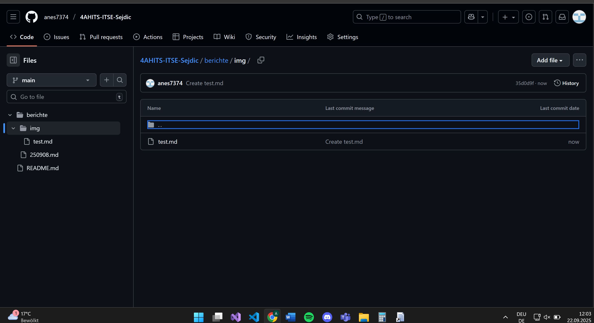

# Überschrift H1
## Überschrift H2
### Überschrift H3
#### Überschrift H4
##### Überschrift H5
###### Überschrift H6

---

**Fetter Text**  
*Kursiver Text*  
~~Durchgestrichen~~  
**_Fett & Kursiv_**

---

> Zitatblock
>> Verschachteltes Zitat

---

- Unsortierte Liste
  - Unterpunkt
    - Noch tiefer

1. Nummerierte Liste
2. Zweiter Punkt
   1. Unterpunkt
   2. Unterpunkt

---

- [ ] Ungecheckte Checkbox  
- [x] Gecheckte Checkbox  

---

[Link zu OpenAI](https://openai.com) 

---

`Inline-Code`

```python
# Code-Block mit Syntax-Highlighting
def hallo():
    print("Hallo Welt")
```

**Bild-Beispiel:**  

